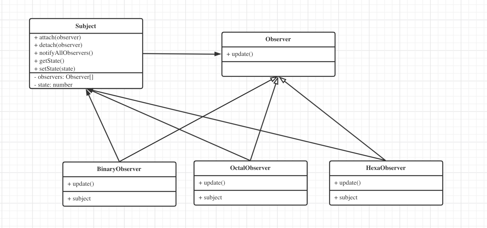

# 观察者模式

## 定义

[观察者模式](https://zh.wikipedia.org/wiki/%E8%A7%82%E5%AF%9F%E8%80%85%E6%A8%A1%E5%BC%8F)是软件设计模式的一种。在此种模式中，一个目标对象管理所有相依于它的观察者对象，并且在它本身的状态改变时主动发出通知。这通常透过呼叫各观察者所提供的方法来实现。此种模式通常被用来实时事件处理系统。

## UNL

## 使用场景

- 网页事件绑定

- 发布订阅

- Promise

- node events.EventEmitter

## 实现

## ES5 实现

> yarn run build

> node dist/Design_Patterns/Observer/index.js
