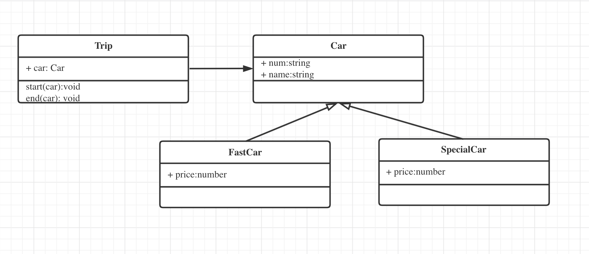
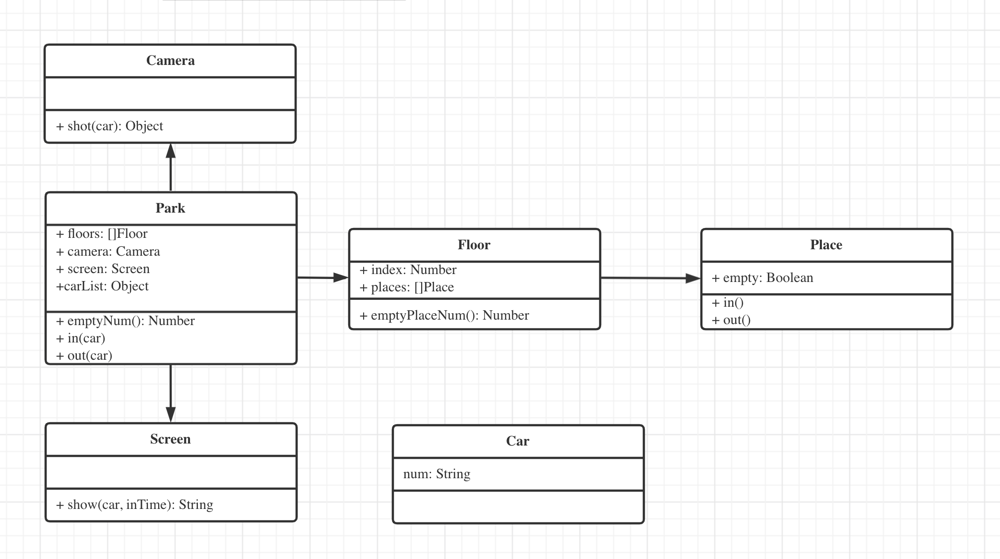

## 1

- 打车时，可以打专车或快车。任何车都有车牌号和名称

- 不同车价格不同，快车每公里 1 元，专车每公里 2 元

- 行程开始时，显示车辆信息

- 行程结束时， 显示打车金额

## 2

- 某停车场，分三层、每层 100 车位

- 每个车位都有监控到车辆到驶入和离开

- 车辆进入前 显示每层的空余车位数量

- 车辆进入时 摄像头可是识别车牌号和时间

- 车辆出来，出口显示器显示车牌号和停车时长

